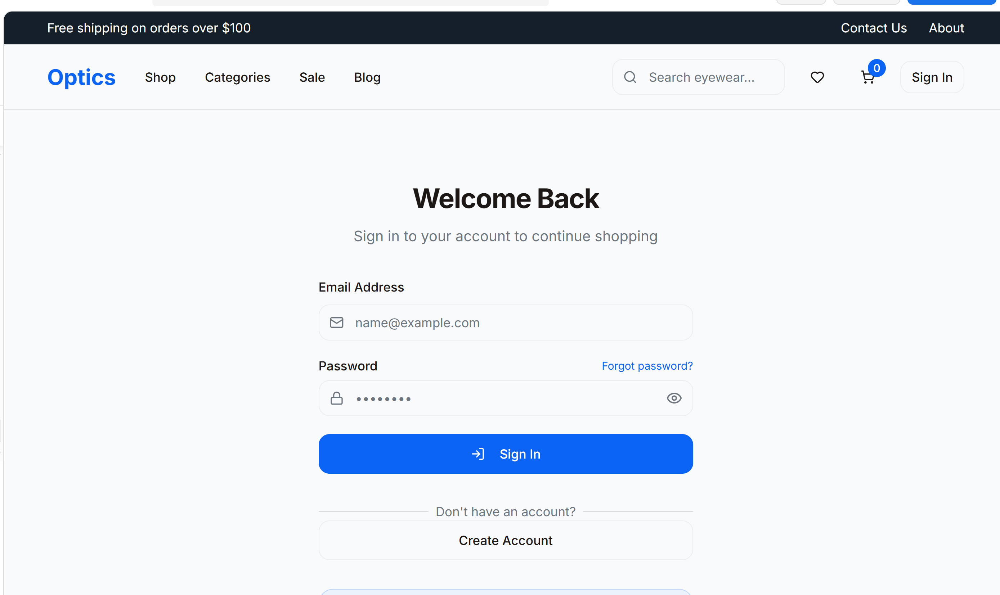
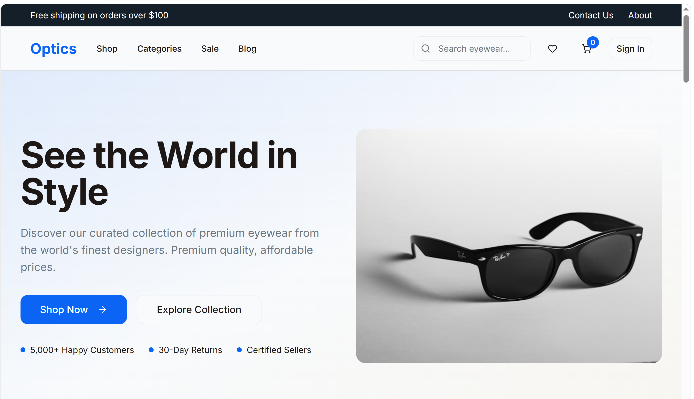
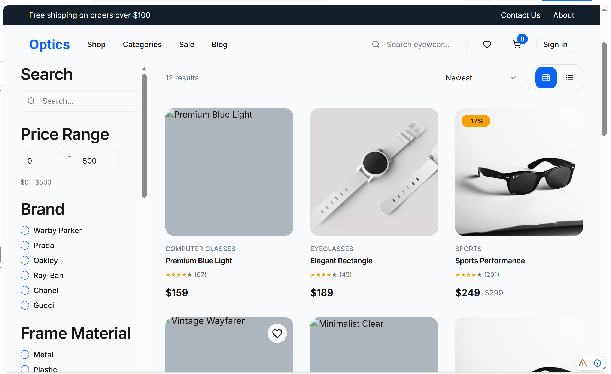
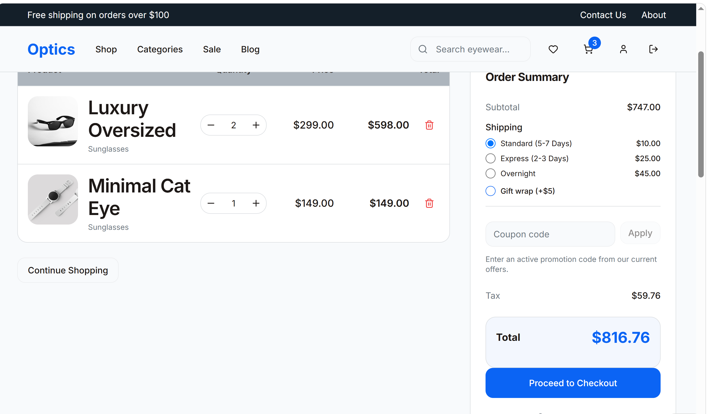
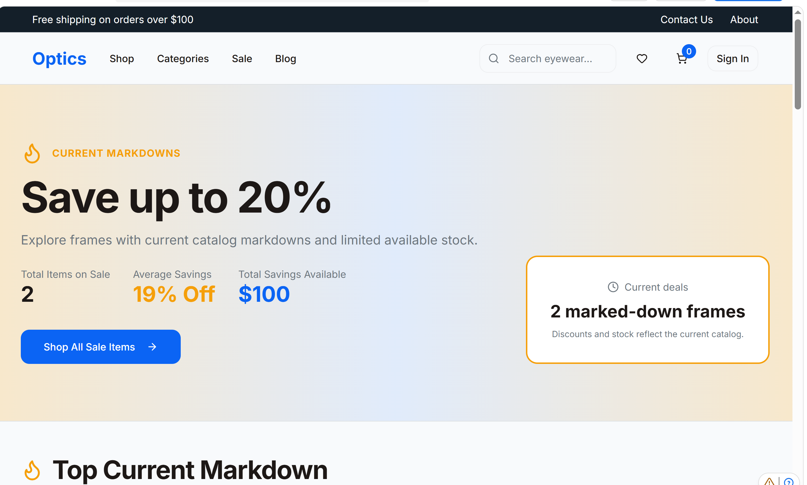

**English** | [فارسی](README.fa.md)

# Eyeglass Store

A full-stack e-commerce web app for an online eyeglass shop. Customers can browse and search products, save favorites to a wishlist, keep a persistent cart, check out, and track their orders. Admins get a dedicated panel to manage products, inventory, promotions, and orders.

## Screenshots


### Login



### Home



### Shop




### Cart and checkout



### Sale




## Features

**For customers**
- **Product catalog** — browse the shop by category, search, and view sale items
- **Product details** — images, descriptions, and a size guide to help choose the right frame
- **Cart** — add and remove items, with the cart persisted across sessions
- **Wishlist** — save products to buy later
- **Checkout and orders** — place orders, view order history and order details
- **Accounts** — register, log in, and manage your profile
- **Blog** — articles and guides about eyewear
- **Newsletter** — subscribe to updates and offers
- **Info pages** — About, Contact, Legal, and Sitemap

**For admins**
- **Admin panel** — protected area for store management
- **Products and inventory** — manage the catalog and stock levels
- **Promotions** — create and apply discounts
- **Orders** — review and manage customer orders

**Security**
- JWT authentication with password hashing (bcrypt)
- Role-based admin middleware
- Security headers with Helmet and API rate limiting
- Request validation with Zod

## Tech Stack

**Frontend**
- React 18 + TypeScript, built with Vite
- React Router and TanStack Query
- Tailwind CSS and shadcn/ui (Radix UI)
- Framer Motion for animations
- Three.js with React Three Fiber for 3D content
- React Context for auth, cart, orders, and wishlist state

**Backend**
- Node.js + Express 5 + TypeScript
- MongoDB with Mongoose
- JWT, bcryptjs, Helmet, express-rate-limit, Zod

**Tooling and deployment**
- pnpm
- Vitest for unit tests
- Prettier and TypeScript type checking
- Netlify (static client + serverless API via `serverless-http`)

## Project Structure

```
Eyeglass store
├─ client/                  # React app
│  ├─ components/           # Header, Footer, ProductCard, ProtectedRoute, ui/
│  ├─ context/              # Auth, Cart, Order, Wishlist contexts
│  ├─ hooks/                # use-products, use-mobile, use-toast
│  ├─ lib/                  # blog data, utils
│  └─ pages/                # Shop, ProductDetail, Cart, Checkout, Orders,
│                           # Wishlist, Profile, Admin, Blog, SizeGuide, ...
├─ server/                  # Express API
│  ├─ middleware/           # auth, admin, security
│  ├─ models/               # User, Product, Cart, Order, Wishlist,
│  │                        # Inventory, Promotion, Newsletter
│  ├─ routes/               # auth, products, cart, wishlist, orders,
│  │                        # newsletter, admin
│  ├─ services/             # catalog, inventory, promotions
│  ├─ scripts/              # seedDB, testConnection
│  └─ db.ts                 # MongoDB connection
├─ shared/                  # Types shared by client and server
├─ netlify/functions/       # Serverless API entry for Netlify
└─ netlify.toml
```

## Getting Started

### Prerequisites

- Node.js 18+
- pnpm
- A MongoDB database (local or MongoDB Atlas)

### Installation

```bash
git clone https://github.com/mohjavad333/Eyewear-Store
cd eyeglass-store
pnpm install
```

### Environment variables

Create a `.env` file in the project root:

```env
MONGODB_URI=your_mongodb_connection_string
JWT_SECRET=your_secret_key
PORT=3000
```

### Check the database connection

```bash
pnpm test:db
```

### Seed the database

Fill the database with sample data:

```bash
pnpm seed
```

### Run in development

Starts the Vite client and the Express backend together:

```bash
pnpm dev
```

### Build and run in production

```bash
pnpm build
pnpm start
```

### Other scripts

| Command | Description |
| --- | --- |
| `pnpm test` | Run unit tests with Vitest |
| `pnpm typecheck` | Run the TypeScript compiler |
| `pnpm format.fix` | Format the codebase with Prettier |

## Documentation

The repo includes extra guides for setup and internals, such as `QUICKSTART.md`, `MONGODB_SETUP.md`, `AUTH_SETUP.md`, `CART_PERSISTENCE.md`, and `ORDER_MANAGEMENT.md`.

## Deployment

The repo includes `netlify.toml` and `netlify/functions/api.ts`, so the client can be deployed on Netlify with the API running as a serverless function. Set the same environment variables in your Netlify site settings.

## Roadmap

- [ ] Online payment gateway
- [ ] Product reviews and ratings
- [ ] Virtual try-on
- [ ] Email notifications for orders
- [ ] Prescription lens options


## Author

**Mohammad Javad Rezaei**
GitHub: [@mohjavad333](https://github.com/mohjavad333/Eyewear-Store)


<div dir="rtl">

